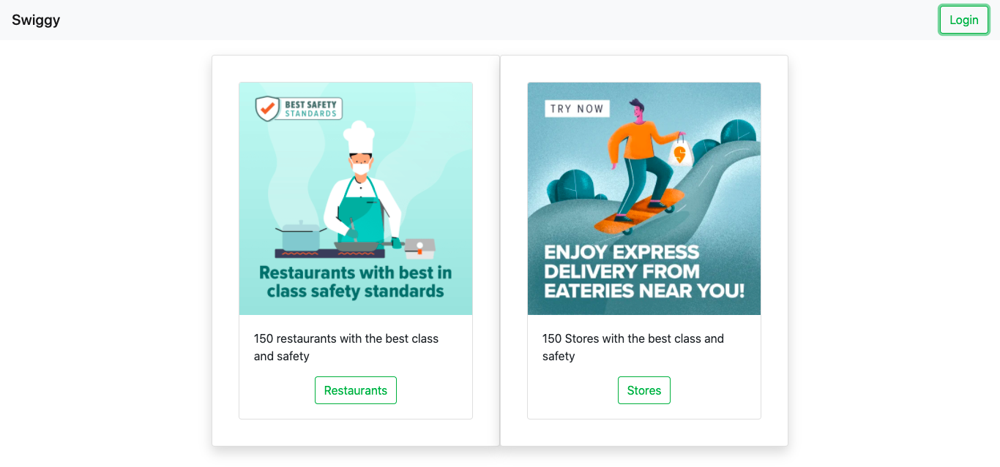
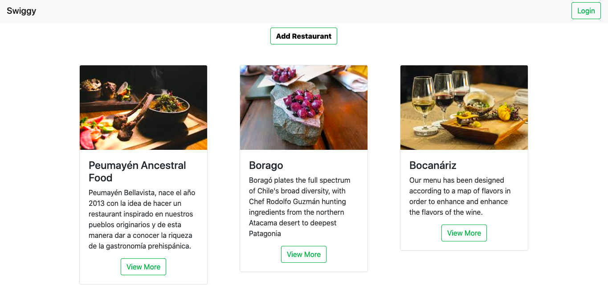
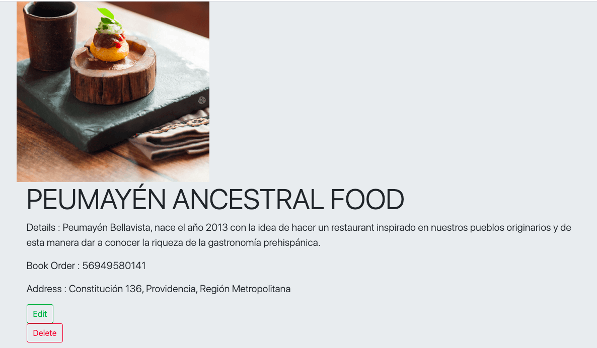

# restaurants-express-mongo

Simple Restaurant & Store crud app using server-side rendering and file uploads.  Users can add restaurant details name, description, phoneNumber, location, and upload an image file.

<a href="https://restaurant-shops.herokuapp.com/" target="_blank"><strong>>> LIVE DEMO</strong></a>

**Technologies used:**

- Express: Back end web application framework for Node.js
- MongoDB: NoSQL database program
- Multer: Node.js middleware for uploading files.
- Ejs: Embedded JavaScript templating language

**Functionalities:**

- Add, Delete, Edit restaurants & shops
- Upload photo files 

---

**Getting started**

   ```
   npm install 
   npm start
   ```

---

**Replace with your env variables**

- In the .env-sample file add the environment variable LOCALMONGO so that it will connect to your MongoDB

**Snapshots**


---


---



## License

Distributed under the [MIT](http://showalicense.com/?fullname=Konstantin+M%C3%BCnster&year=2019#license-mit) license.

See `LICENSE` for more information.
